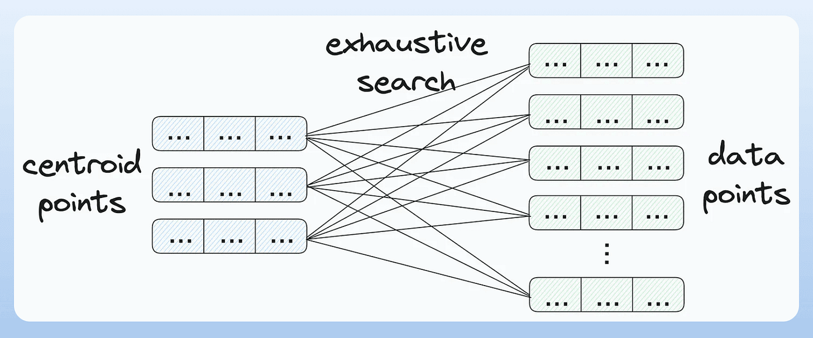
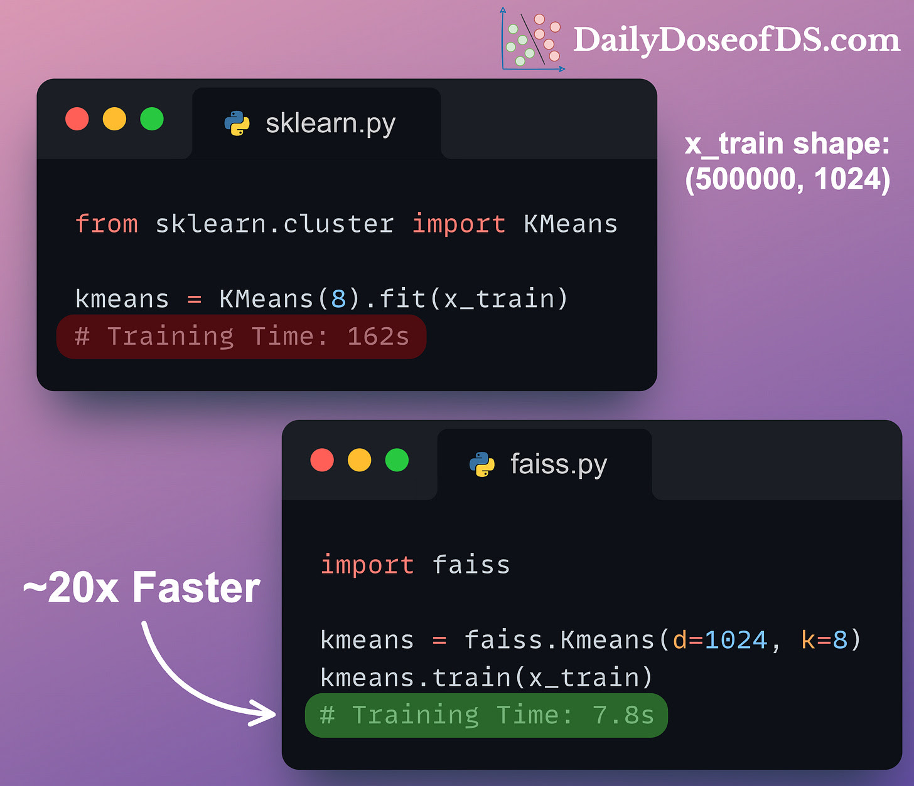
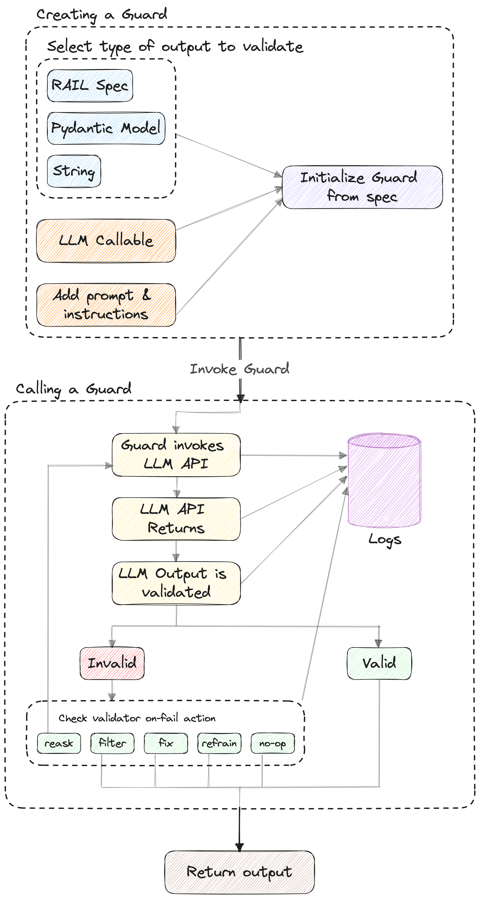

## Accelerating KMeans with Faiss

KMeans clustering works in an iterative loop:

1. Initialize cluster centroids
2. Assign each data point to its closest centroid
3. Update centroids based on current assignments
4. Repeat until convergence

The main bottleneck? **Step 2** — computing the distance from every data point to every centroid. This becomes painfully slow when working with high-dimensional or large-scale datasets:

> 


**Enter Faiss:** Fast Clustering with Approximate Nearest Neighbors

**Faiss** (by Facebook AI Research) speeds up the nearest centroid search by using **Approximate Nearest Neighbor (ANN)** techniques.

It relies on an **Inverted Index**, a smart data structure that efficiently stores and retrieves high-dimensional vectors — something we also covered in our deep dive on vector databases:
🔗 *\[Beginner-friendly Guide to Vector Databases]*

This allows Faiss to massively cut down on computation time while keeping accuracy within acceptable bounds.

> 

As you can see above, with 500k vectors (each 1024-dimensional), Faiss achieves a **\~20x speedup** compared to vanilla KMeans from Scikit-learn.


## ​Guardrails for AI Agents​

AI agents are powerful, but without safeguards, they can:

* Hallucinate
* Enter infinite loops
* Give unreliable outputs

> 


### 🛡️ Guardrails Fix This:

* 🔒 Limit tool usage
* ✅ Add validation checkpoints
* 🔁 Define fallback mechanisms

Essential for safe, reliable, and robust AI agent behavior.


```python

def validate_summary_length(task_output):
    try:
        print("Validating summary length")
        task_str_output = str(task_output)
        total_words = len(task_str_output.split())

        print(f"Word count: {total_words}")

        if total_words > 150:
            print("Summary exceeds 150 words")
            return (
                False,
                f"""Summary exceeds 150 words.
            Current Word count: {total_words}""",
            )

        if total_words == 0:
            print("Summary is empty")
            return (False, "Generated summary is empty.")

        print("Summary is valid")
        return (True, task_output)

    except Exception as e:
        print("Validation system error")
        return (False, f"Validation system error: {str(e)}")
```

```python
summary_task = Task(
    description="Summarize a ML topic in 150 words.",
    expected_output="""A summary of CNNs in 150 words""",
    agent=summary_agent,
    guardrail=validate_summary_length,  # <-- Guardrail function is added here
)
```