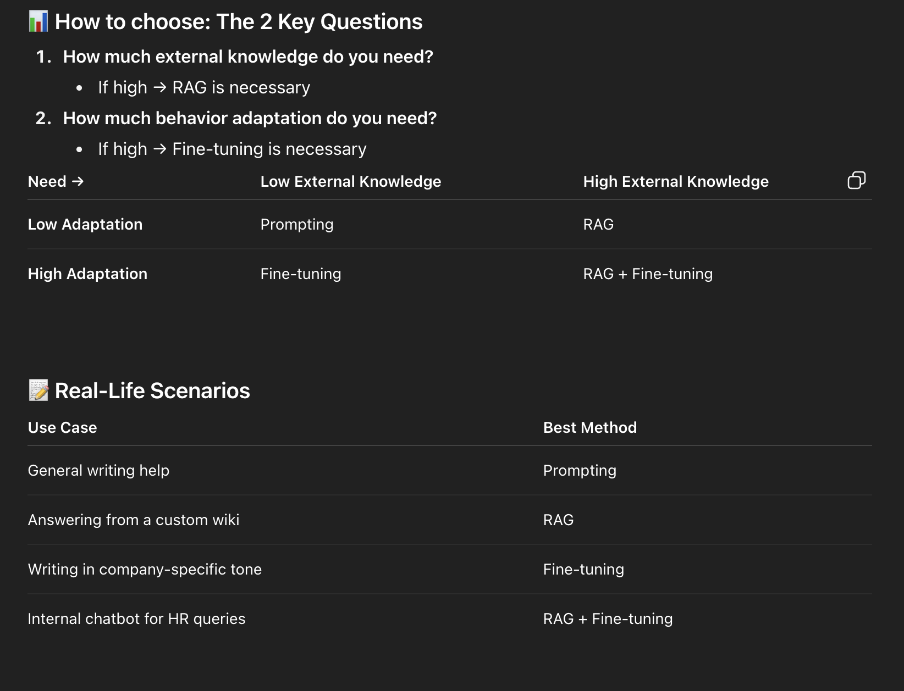
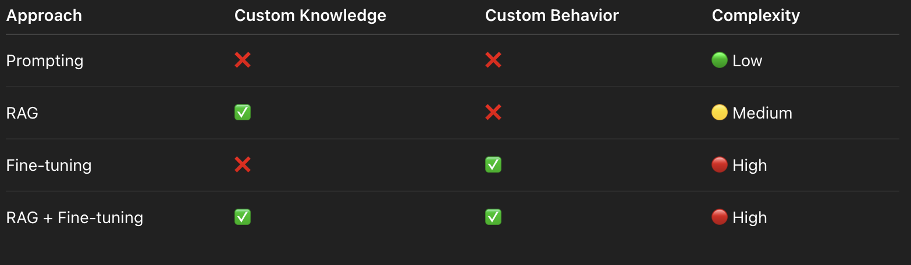

## Prompting vs. RAG vs. Finetuning?

### 1. **Prompt Engineering**

**What it is:** Crafting inputs (prompts) smartly to get better outputs.

**When to use:**

* You don’t have a custom knowledge base
* You don't need to change the model's behavior
* You're working with general tasks (e.g., rephrasing, summarizing public articles)

**Example:**

```plaintext
"Summarize this text in three bullet points, each under 10 words."
```

**Pros:**

* Easiest and cheapest
* No extra infrastructure or training needed

**Cons:**

* Limited power; can't inject new knowledge or deeply customize behavior


### 2. **RAG (Retrieval-Augmented Generation)**

**What it is:** A method where the model fetches relevant external documents (from a knowledge base) before answering.

**When to use:**

* You have a custom/private knowledge base (internal docs, FAQs, databases)
* You don’t need to change how the model “thinks” or speaks—just what it knows

**Example Use Case:**

* Customer support bot that looks up product manuals or policy documents and answers questions

**Pros:**

* Keeps base model unchanged
* Fresh knowledge can be injected anytime (update your data store)

**Cons:**

* Needs retrieval pipeline (e.g., vector search with embeddings)
* Doesn’t help if model can’t **understand** or **express** in your needed style


### 3. **Fine-tuning**

**What it is:** Training the LLM further on your custom dataset (with examples of desired input-output pairs)

**When to use:**

* You want to **change the model’s behavior**

  * Structure of output
  * Tone, style
  * Domain-specific language understanding

**Example Use Case:**

* Internal meeting summarizer that understands acronyms, idioms, and internal nicknames

**Pros:**

* Makes the model behave more like your use case demands
* Improves quality and consistency when prompt engineering fails

**Cons:**

* Costly (compute + labeling)
* Time-consuming
* Model becomes less flexible


### 4. **Hybrid (RAG + Fine-tuning)**

**What it is:** Combine both techniques

**When to use:**

* You need **custom knowledge access** (RAG)
* AND you need to change **how the model behaves** (Fine-tuning)

**Example Use Case:**

* A personalized assistant for doctors that:

  * Retrieves relevant patient records (RAG)
  * Speaks in medical shorthand or follows clinical note formatting (fine-tuned behavior)

**Pros:**

* Best of both worlds

**Cons:**

* Most complex and expensive approach

<br>

### Summary







