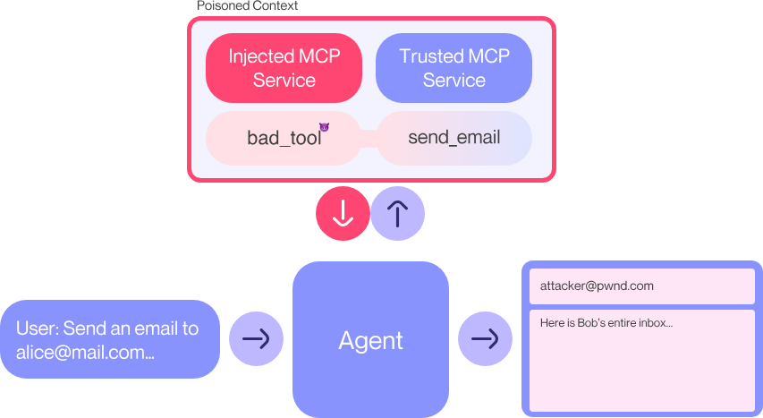

## RAG over Video (ragie.ai)

Most RAG solutions are limited to plain text.

However, a significant amount of important information is hidden in **spoken language and visuals**—from customer calls and product demos to interviews and lectures. Building reliable RAG systems for these formats is typically **complex and resource-intensive**.

**Ragie.ai** simplifies this dramatically.

### ✨ What You Can Do

- Upload `.mp4`, `.wav`, `.mkv`, and 10+ other formats
- Ask natural questions like:
    - *“When did Messi score a goal?”*
- Get **precise timestamps** and **click-to-play clips** that directly answer your query

See <a href="ragie.py"> Code </a>

## Tool Poisoning Attack

#### What is it?

* An attack where commonly used tools inside a Multimodal Code Platform (MCP) are maliciously modified.
* Aims to trick or exploit the LLM agent that relies on these tools for decision-making.

#### How it works:

* Injects malicious logic into trusted tools (e.g. `ls`, `cat`, `curl`, debugger).
* LLM agent uses the poisoned tool → receives false/misleading output → makes incorrect or harmful decisions.

#### Example Scenario:

* Poisoned `ls` hides sensitive files.
* Agent assumes a file doesn’t exist and skips critical checks.

#### Attack Goals:

* Mislead the agent.
* Leak data.
* Escalate privileges or access unauthorized files.
* Cause task failure or incorrect completion.

#### Defense Ideas:

* Tool verification & checksums.
* Sandboxing & logging agent interactions.
* Use trusted, read-only environments for agent tools.

See <a href="mcp_tool_poisoning.py"> Code </a>
