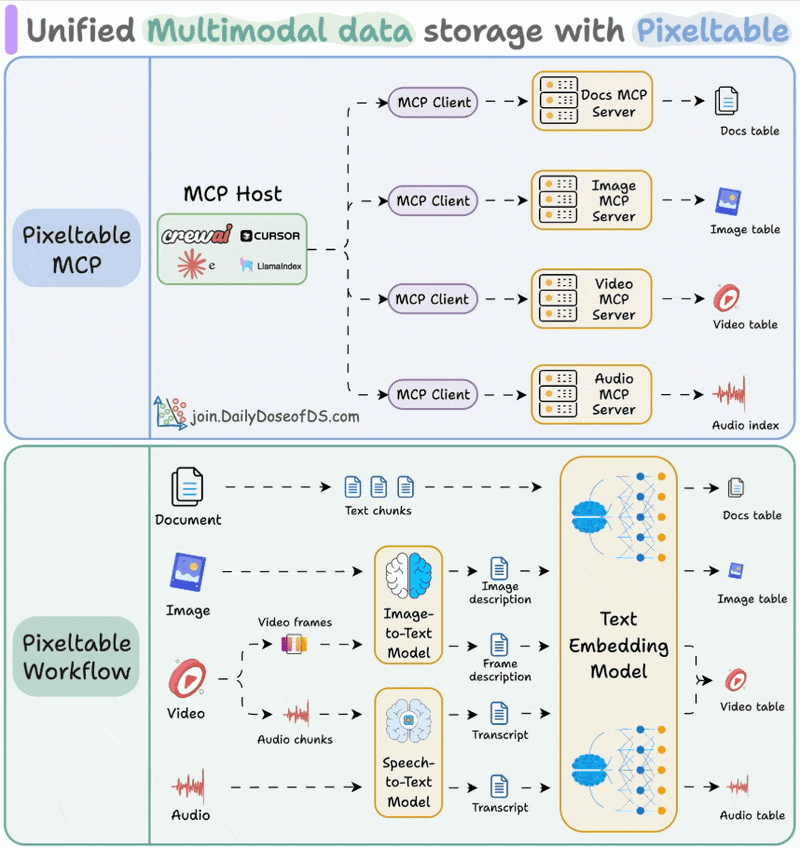

## MCP Server with MultiModal AI


### Tech Stack
- AI Infra : PixelTable
- Orchestrator : CrewAI



`MCP`
```python
from crewai_tools import MCPServerAdapter

# PixelTable SSE Servers
server_configurations = [
    {"url": "http://0.0.0.0:8080/sse", "transport": "sse"},
    {"url": "http://0.0.0.0:8081/sse", "transport": "sse"},
    {"url": "http://0.0.0.0:8082/sse", "transport": "sse"},
    {"url": "http://0.0.0.0:8083/sse", "transport": "sse"},
]

# Create MCP Tool Adapter
with MCPServerAdapter(server_configurations) as mcp_tools:
    print(f"Available tools: {[tool.name for tool in mcp_tools]}")

    # ... Next is crew setup ...
```


`CrewAI`
```python
from crewai import Agent, Task
from pydantic import BaseModel

# Model Output Class
class Specialist(BaseModel):
    name: str

# Define the Router Agent
router_agent = Agent(
    role="Task Router",
    goal="Analyze user's query and determine correct specialist.",
    backstory="An expert in routing tasks to appropriate specialist.",
    llm=router_llm  # This should be defined elsewhere
)

# Define the Routing Task
routing_task = Task(
    description=f"Analyze query and determine specialist: '{{query}}'.",
    expected_output="""
    MUST be from the following options:
     - 'image_specialist'
     - 'video_specialist'
     - 'audio_specialist'
     - 'document_specialist'
    """,
    agent=router_agent,
    output_json=Specialist,
)
```

`Video Specialist`
```python
from crewai import Agent, Task
from crewai_tools import MCPServerAdapter

# Assume server_configurations is defined earlier
with MCPServerAdapter(server_configurations) as mcp_tools:

    # Define the video specialist agent
    agent = Agent(
        role="Video Specialist",
        goal="Understand user queries and perform video operations using Pixeltable.",
        backstory=(
            "Trained in video data management. Expertise in search retrieval, "
            "index optimization, transform video into searchable knowledge bases."
        ),
        tools=[
            mcp_tools["setup_video_index"],
            mcp_tools["insert_video"],
            mcp_tools["query_video"],
            mcp_tools["list_video_tables"]
        ],
        llm=agent_llm  # This should be defined earlier
    )

    # Define the associated task
    task = Task(
        description="Interpret query and take video Pixeltable's tools: '{query}'.",
        expected_output="""
        Output should include:
        - Reasoning of performed operation
        - Summary of successful tool use
        - Recommended next actions
        """,
        agent=agent,
        markdown=True
    )
```

`Synthesis Specialist`
```python
from crewai import Agent, Task

# Define the synthesis agent
synthesis_agent = Agent(
    role="Synthesis Specialist",
    goal="Craft user response based on output from specialist.",
    backstory="An expert in communication and summarization.",
    llm=response_llm,  # This should be defined elsewhere
)

# Define the synthesis task
synthesis_task = Task(
    description=f"Review '{{specialist_output}}' to present user",
    expected_output="A polished, final response for end-user.",
    agent=synthesis_agent,
)
```

`WorkFlow`
```python
from crewai.flow.flow import Flow, router, start, listen, or_
from typing import Dict, Any

class PixelTableManagerFlow(Flow[PixelTableFlowState]):

    # Step 1: User Query
    @start()
    def start_flow(self) -> Dict[str, Any]:
        return {"query": self.state.query}

    # Step 2: Route Query to Appropriate Specialist
    @router(start_flow)
    def route_query(self) -> str:
        route = Crew(agents=[router_agent], tasks=[routing_task]).kickoff()
        return route["name"]

    # Step 3: Handle Specialized Agents
    @listen("image_specialist")
    def handle_image_task(self) -> Dict[str, Any]:
        crew = Crew(agents=[agent], tasks=[task])
        return {"result": str(crew.kickoff())}

    @listen("video_specialist")
    def handle_video_task(self) -> Dict[str, Any]:
        crew = Crew(agents=[agent], tasks=[task])
        return {"result": str(crew.kickoff())}

    @listen("audio_specialist")
    def handle_audio_task(self) -> Dict[str, Any]:
        crew = Crew(agents=[agent], tasks=[task])
        return {"result": str(crew.kickoff())}

    @listen("document_specialist")
    def handle_document_task(self) -> Dict[str, Any]:
        crew = Crew(agents=[agent], tasks=[task])
        return {"result": str(crew.kickoff())}

    # Step 4: Final Response via Synthesis Agent
    @listen(or_("handle_image_task", "handle_video_task", "handle_audio_task", "handle_document_task"))
    def synthesize_result(self, specialist_output: str) -> Dict[str, Any]:
        crew = Crew(agents=[synthesis_agent], tasks=[synthesis_task])
        return {"result": str(crew.kickoff())}
```


`Test`
```python
from IPython.display import display, Markdown

flow = PixelTableManagerFlow()

result = await flow.kickoff_async(inputs={
    'query': "Name the younger kid shown in video stored in video index 'two_kids'?"
})

display(Markdown(result['result']))
```