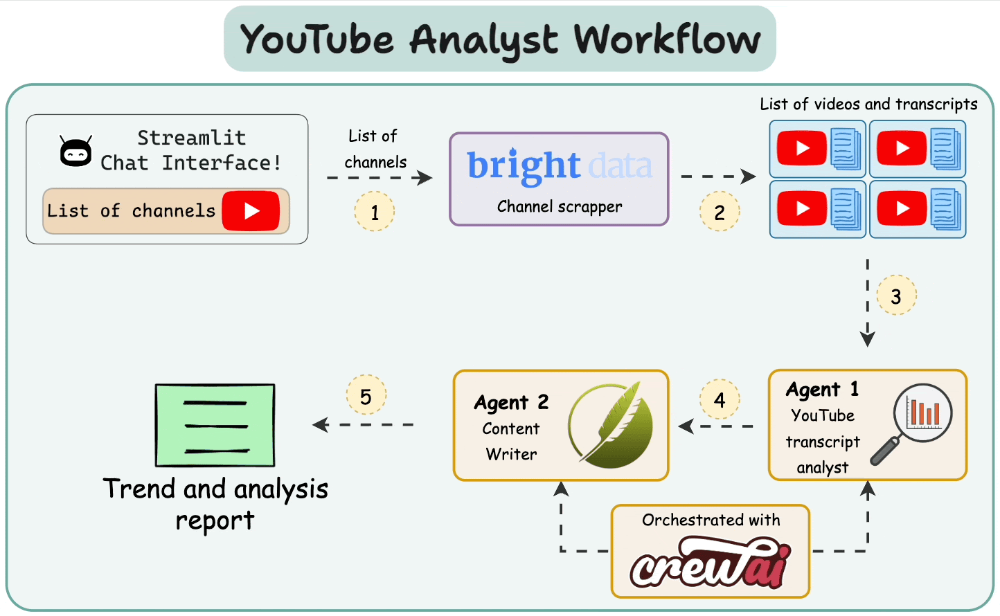

## How Do LLMs Work?

Large Language Models (LLMs) like GPT-4 generate text using **conditional probability**.

### 1. Conditional Probability

Conditional probability measures the likelihood of an event **A** given another event **B**, written as:

$$
P(A|B)
$$

Example: If it’s cloudy (B), the probability of rain (A) is higher.

### 2. Next-Word Prediction

LLMs use this concept to predict the **next word** in a sequence:

* They compute the conditional probability for every possible next word.
* The word with the highest probability is usually selected.
* The model learns these probabilities by training on massive text datasets, with the parameters stored in its weights.

### 3. The Problem of Repetition

If an LLM always picks the **most likely word**, outputs become repetitive and dull.

### 4. The Role of Temperature

To encourage creativity, LLMs **sample** words instead of always picking the top candidate.

* **Low temperature** → deterministic, focused output.
* **High temperature** → more randomness and diverse outputs.

Temperature modifies the **softmax function**, adjusting how probabilities are distributed during sampling.

LLMs generate text by predicting the next word based on conditional probability. By introducing sampling and temperature, they balance accuracy and creativity.

## Multi-agent YouTube video analyst

This project builds an **end-to-end workflow** that:
- Scrapes videos from multiple YouTube channels.
- Uses a **multi-agent system** to analyze data and generate trends & insights.
- Provides an interactive **UI for visualization and reporting**.

### Architecture Overview

The system is composed of the following key components:

1. **Scraping Layer (Bright Data)**

   * Extracts video metadata (title, description, views, upload date) from multiple YouTube channels.
   * Handles rate-limiting, proxies, and scraping reliability at scale.

2. **Analysis Layer (CrewAI)**

   * Multi-agent system coordinates different tasks:

     * **Data Cleaner Agent** → Prepares raw video data for analysis.
     * **Trend Detector Agent** → Identifies emerging topics.
     * **Insights Reporter Agent** → Generates human-readable summaries.

3. **UI Layer (Streamlit)**

   * Displays insights in a dashboard.
   * Interactive filtering by channel, date range, or topic.
   * Presents trends, graphs, and auto-generated reports.

See <a href="youtube_video_analyst/">code here</a>