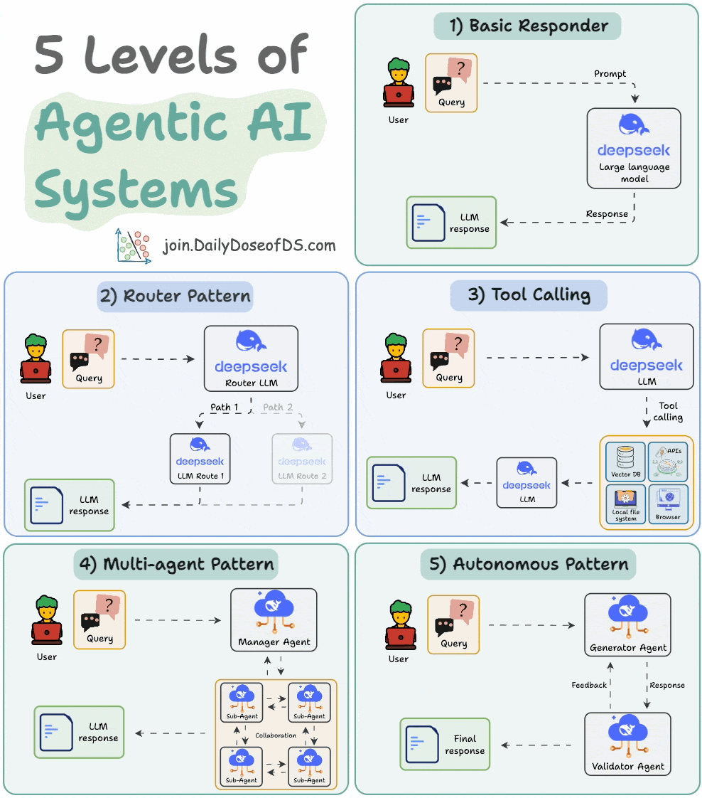

## AI Assistant Using 6 MCP Servers

**Tech stack:**
- mcp-use to connect LLM to MCP servers
- Stagehand MCP for browser access
- Firecrawl MCP for scraping
- Ragie MCP for multimodal RAG
- Graphiti MCP as memory
- Terminal & GitIngest MCP

## 5 Levels of Agentic AI Systems

### **1️⃣ Basic Responder**

* **Flow:** User → Query → LLM → Response
* **Description:**

  * The simplest form of AI interaction.
  * User provides a query (prompt), and the LLM generates a direct response.
* **Use case:**

  * Chatbots, text generation, simple Q\&A.
* **Limitation:**

  * No external tools, routing, or complex reasoning.

### **2️⃣ Router Pattern**

* **Flow:** User → Router LLM → (Selects path) → Specific LLM → Response
* **Description:**

  * A "Router LLM" determines which specialized LLM or model route should handle the query.
  * Each route is optimized for a specific domain (e.g., coding, finance, legal queries).
* **Use case:**

  * Multi-domain assistants, customer support with specialized routing.
* **Limitation:**

  * Still linear, only selects one route.

### **3️⃣ Tool Calling**

* **Flow:** User → LLM → Tool (API, database, browser, etc.) → LLM → Response
* **Description:**

  * The LLM can invoke external tools or APIs to gather additional data.
  * Example tools: vector databases, APIs, local file systems, browsers.
* **Use case:**

  * Retrieval-augmented generation (RAG), data analysis, dynamic information fetching.
* **Limitation:**

  * Still single-agent; depends on tools rather than other agents.

### **4️⃣ Multi-Agent Pattern**

* **Flow:** User → Manager Agent → Multiple Sub-Agents (Collaborate) → Response
* **Description:**

  * A "Manager Agent" coordinates multiple specialized agents (sub-agents).
  * Each sub-agent can handle a part of the query, and they collaborate to produce a result.
* **Use case:**

  * Complex workflows, software engineering agents, research agents.
* **Limitation:**

  * Needs well-designed coordination and communication between agents.

### **5️⃣ Autonomous Pattern**

* **Flow:** User → Generator Agent ↔ Validator Agent → Feedback loop → Final Response
* **Description:**

  * Agents operate autonomously with self-feedback.
  * A generator agent creates solutions, and a validator agent critiques/improves them.
  * Can loop until a satisfactory solution is found.
* **Use case:**

  * Fully autonomous systems for problem-solving, research, or decision-making.
* **Strength:**

  * Highest level of intelligence and autonomy.

## Build Own Reasoning LLM

Reinforcement Fine-Tuning (RFT) enables you to transform any open-source LLM into a **reasoning powerhouse**—without the need for labeled data.

### 🚀 Key Concepts

#### 1️⃣ Supervised Fine-Tuning (SFT)

* **Input**: A static labeled dataset of **prompt–completion** pairs.
* **Process**:

  1. Train the model to match the labeled completions.
  2. Save the best model (LoRA checkpoint).
  3. Deploy for inference.
* **Limitation**: Requires curated labeled data.

#### 2️⃣ Reinforcement Fine-Tuning (RFT)

* **Input**: No labeled data required.
* **Process**:

  1. The model explores different outputs.
  2. A **Reward Function** scores each output based on correctness.
  3. Using **GRPO** (Generalized Reinforcement Policy Optimization), the model learns to maximize rewards.
* **Outcome**: A model that **iteratively improves reasoning** through exploration.

###  Why RFT?

* No need for costly labeled datasets.
* Ideal for reasoning-heavy tasks (math, logic, planning).
* Continuous self-improvement based on feedback signals.

### Example Workflow

1. Start with any open-source LLM (e.g., LLaMA, Mistral).
2. Define a **Reward Function** (e.g., correctness on math problems).
3. Train using **RFT** and GRPO.
4. Deploy your reasoning-optimized model.
