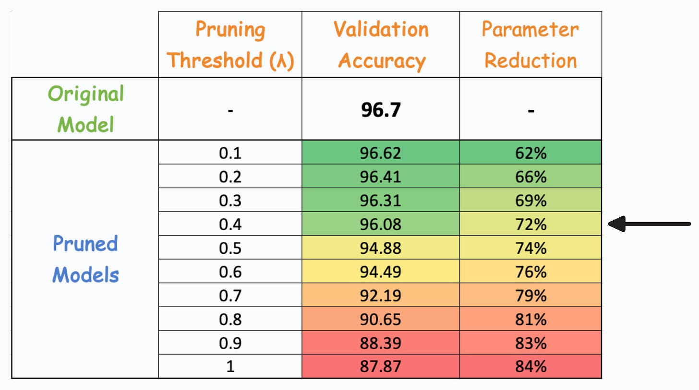
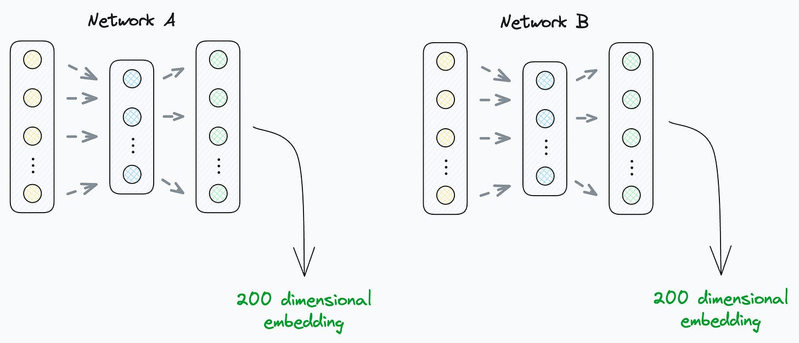

## Activation Pruning in NN
* After training, many neurons contribute very little to the model’s performance but still consume memory.
* We can detect such neurons by running the dataset through the trained model (without backpropagation) and measuring their average activations.
* Neurons with activations consistently near zero are candidates for pruning.
* A pruning threshold (λ) is used to remove these low-activation neurons.
* Example: At λ=0.4, pruning reduced parameters by **72%** while accuracy dropped only **0.62%**.
* This shows a good trade-off between model size and performance.
* Pruning is especially useful for deployment, where speed, efficiency, and memory usage matter as much as accuracy.
* Model compression techniques like pruning make networks lighter and more operationally efficient.




```python
# Implement zero-pruning
# Define pruning threshold (lambda)
threshold = 0.02

# Iterate through model layers
for name, module in model.named_modules():
    # Only prune Linear layers
    if isinstance(module, torch.nn.Linear):
        # Prune entire neurons (along output dimension)
        prune.ln_structured(module, name="weight", amount=threshold, n=2, dim=0)
        prune.remove(module, 'weight').0
```

## Leverage Power of 2 different Embeddings

### ❌ What NOT to do

* **Do not directly compare embeddings** (e.g., cosine similarity or Euclidean distance) from different models just because they have the same dimensionality.
* These embeddings lie in **different vector spaces**; their axes are not aligned.
* Comparing them assumes perfect alignment, which is almost never true unless explicitly trained for it.



### 📌 Why alignment is an issue

* Imagine two embeddings in 3D space:

  * Their **z-axes** might align.
  * But their **x** and **y** axes could be rotated relative to each other.
* Although both are 3D vectors, direct comparison is meaningless because of this rotation (or more complex transformations).
* The same logic applies to higher-dimensional embeddings like 200-d or 768-d from NLP models.


### ✅ Correct ways to handle multiple embeddings

1. **Use embeddings from the same network** if you need to compute similarity (e.g., cosine similarity).
2. **Align embeddings** if using different networks:

   * Techniques like **Procrustes alignment**, **CCA (Canonical Correlation Analysis)**, or **learned linear transformations** can map embeddings into a shared space.
3. **Concatenate embeddings** (recommended in most cases):

   * Simply stack vectors from both models into one larger vector `[e1, e2]`.
   * Works even if dimensions differ (e.g., 200-d + 768-d → 968-d).
   * The downstream model will learn to combine them.