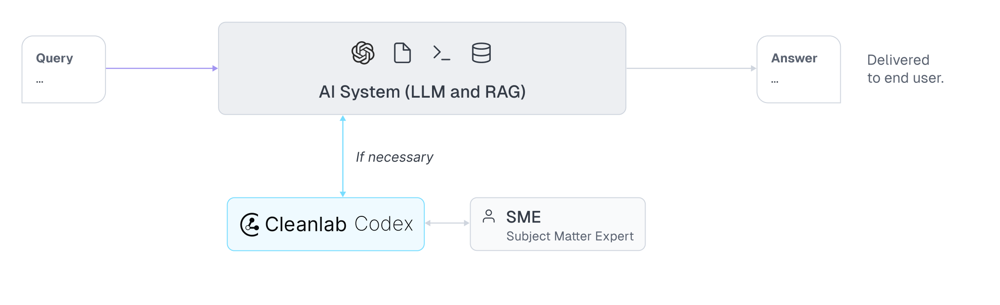

## CleanUp Codex
- Detects incorrect AI responses in real-time with state-of-the-art precision.
- Fix bad AI responses once and for all.

## Multimodal Agentic RAG
Tech giants use Multimodal RAG every day in production!
- Spotify uses it to answer music queries
- YouTube uses it to turn prompts into tracks
- Amazon Music uses it to create a playlist from a prompt

Today, let's learn how to build a Multimodal Agentic RAG that can query documents and audio files using the user’s speech.

**Tech stack:**
- ​AssemblyAI for transcription.
- Milvus as the vector DB.
- ​Beam for deployment (open-source).
- CrewAI Flows for orchestration.

## Model Interpretability

But interpretability isn’t just about quantifying “trust” in a model.

It’s also an opportunity for continuous improvement.

